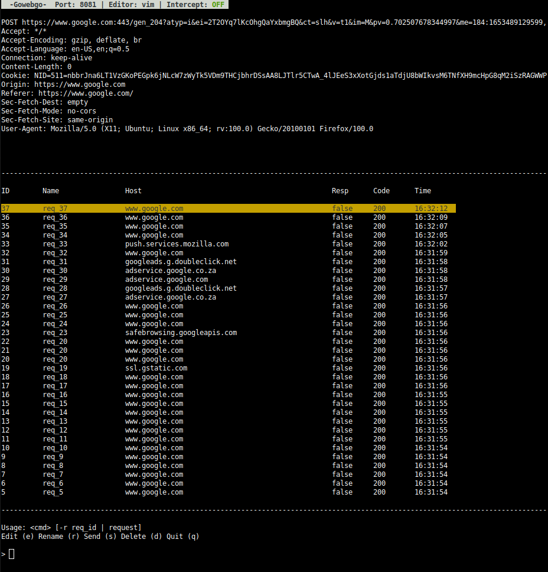

# Gowebgo
A CLI web proxy and request inspector/editor written in Golang, adapting the [go-httpproxy](https://pkg.go.dev/github.com/go-httpproxy/httpproxy) library (source available [here](https://github.com/go-httpproxy/httpproxy)).

Yes, the name is a reference to Spiderman 1 (with Toby Maguire).

